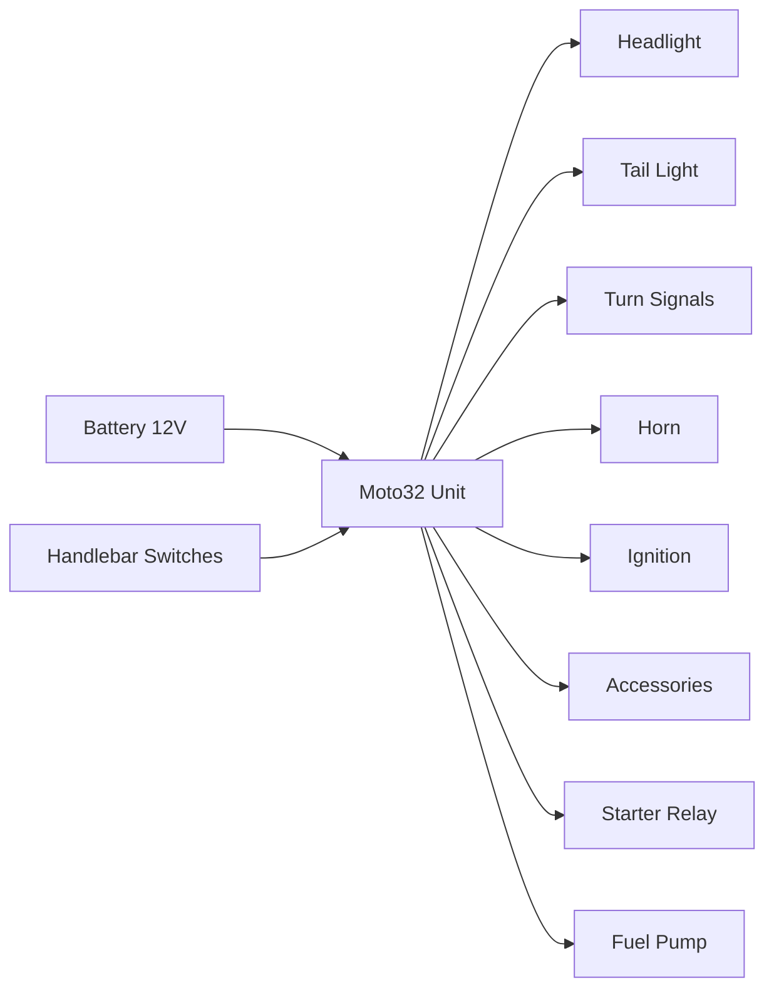

Welcome to **Moto32**, a complete open-source motorcycle control unit designed as an alternative to the **Motogadget M-Unit Blue**.

## What is Moto32?

Moto32 is an ESP32-S3 based control unit that manages all electrical systems on custom motorcycles. It provides 8 MOSFET-protected outputs for controlling lights, horn, ignition, indicators, and other accessories - all from a single compact unit.

This project is perfect for:

::card-group
  :::card
  ---
  icon: i-lucide-wrench
  title: Custom Motorcycle Builders
  ---
  Replace bulky relays and fuse boxes with a single intelligent control unit.
  :::

  :::card
  ---
  icon: i-lucide-code
  title: DIY Electronics Enthusiasts
  ---
  Learn about automotive electronics, ESP32 development, and PCB design.
  :::

  :::card
  ---
  icon: i-lucide-lightbulb
  title: Makers & Hackers
  ---
  Modify and extend the design for your specific needs and applications.
  :::

  :::card
  ---
  icon: i-lucide-graduation-cap
  title: Students & Educators
  ---
  Study a real-world automotive electronics project with complete documentation.
  :::
::

## Why Moto32?

The commercial Motogadget M-Unit Blue is an excellent product but costs several hundred dollars. Moto32 provides a similar feature set at a fraction of the cost, with the added benefits of:

:prose-ul{icon="i-lucide-check-circle"}
- **Complete transparency**: Full schematics, BOM, and firmware source code
- **Customization freedom**: Modify hardware and software for your exact needs
- **Learning opportunity**: Understand how motorcycle control units work
- **Community support**: Active development and user community
- **No vendor lock-in**: You own and control everything
- **Future expansion**: Built on ESP32 platform with endless possibilities

::callout{icon="i-lucide-info" color="blue"}
**Cost Comparison**: A commercial M-Unit Blue retails for $300-400. Moto32 can be built for under $50 in components (excluding PCB fabrication).
::

## Key Features

### Hardware
- **ESP32-S3 MCU**: Powerful dual-core processor with Wi-Fi and Bluetooth
- **8 Protected Outputs**: MOSFET channels rated for automotive loads
- **USB-C Programming**: Easy firmware updates without external programmers
- **Automotive Protection**: TVS diodes, fuse protection, and robust design
- **Compact Form Factor**: Optimized PCB layout for motorcycle installation

### Firmware Capabilities
- **Configurable I/O Mapping**: Define which input controls which output
- **Short Circuit Protection**: Detect and respond to output faults
- **Bluetooth Configuration**: Wireless setup via smartphone (in development)
- **Custom Logic**: Implement turn signal auto-cancel, hazard lights, etc.
- **CAN Bus Support**: Future integration with modern motorcycle electronics

### Documentation & Support
- **Complete Schematics**: Full circuit diagrams with component values
- **Detailed BOM**: Part numbers and suppliers for every component
- **3D Models**: STEP files for enclosure design and mechanical integration
- **Assembly Guide**: Step-by-step instructions with photos
- **Example Firmware**: Working code to get started immediately

## Project Status

::callout{icon="i-lucide-alert-triangle" color="amber"}
**Current Status**: Prototype/Experimental

Moto32 is functional and has been tested on the bench and in real-world installations. However, it is still under active development. Use at your own risk on your motorcycle.
::

### What Works
:prose-ul{icon="i-lucide-check"}
- ✅ All 8 MOSFET outputs functioning
- ✅ USB-C programming and serial communication
- ✅ Basic input/output firmware
- ✅ Power supply and regulation
- ✅ PCB design validated

### In Development
:prose-ul{icon="i-lucide-wrench"}
- 🔧 Advanced firmware features (auto-cancel, timers, etc.)
- 🔧 Bluetooth smartphone app for configuration
- 🔧 CAN bus communication support
- 🔧 Over-current detection and protection
- 🔧 Comprehensive testing and validation

### Roadmap
:prose-ul{icon="i-lucide-map"}
- 📋 Production-ready firmware v1.0
- 📋 Mobile app for iOS/Android
- 📋 Enclosure design and mounting solutions
- 📋 Wiring harness templates for popular motorcycles
- 📋 Video tutorials and build guides

## How It Works

Moto32 acts as the central electrical control hub for your motorcycle:

**Input Side**: Receives signals from handlebar switches, sensors, and other inputs. The ESP32 monitors these inputs and executes control logic.

**Processing**: The ESP32 firmware interprets inputs and determines which outputs should be active. This can include simple switching or complex logic (e.g., turn signal auto-cancel based on lean angle).

**Output Side**: Activates MOSFET switches to power lights, horn, ignition coil, fuel pump, and other loads. Each output is protected against short circuits and overcurrent.

## Getting Started

Ready to build your own Moto32? Here's what you'll need:

:prose-ol
1. **Order PCBs**: Use [PCBWay](https://www.pcbway.com/project/shareproject/Motogadget_Clone_0a54cb40.html) to order professionally manufactured PCBs
2. **Source Components**: Get all parts from the [detailed BOM](/hardware/bill-of-materials)
3. **Assemble**: Follow the [assembly guide](/hardware/assembly) to solder components
4. **Program**: Install firmware using the [firmware guide](/firmware/getting-started)
5. **Test**: Bench test all outputs before installation
6. **Install**: Mount in your motorcycle following [installation guide](/assembly/motorcycle-installation)

::callout{icon="i-lucide-zap" color="yellow"}
**Safety First**: Always disconnect your motorcycle battery before working on electrical systems. Test thoroughly on the bench before installing on your bike.
::

## Community & Support

Moto32 is an open-source project that thrives on community contributions:

- **GitHub Repository**: [github.com/jaksatomovic/motogadget-clone](https://github.com/jaksatomovic/motogadget-clone)
- **Issues & Bugs**: Report problems via GitHub Issues
- **Feature Requests**: Suggest improvements and new features
- **Pull Requests**: Contribute code, documentation, or improvements
- **Share Your Build**: Post photos and experiences to help others

## License

Moto32 is released under the **MIT License**, which means:

:prose-ul{icon="i-lucide-unlock"}
- ✅ Free to use for personal or commercial projects
- ✅ Modify and adapt as you see fit
- ✅ Distribute your changes
- ✅ No licensing fees or restrictions

The only requirement is attribution - please credit the original project when sharing or building upon it.

## Acknowledgments

**Special thanks to [PCBWay](https://www.pcbway.com)** for sponsoring PCB fabrication and supporting this open-source project. Their high-quality manufacturing and excellent customer service make projects like this possible.

---

::callout{icon="i-lucide-rocket"}
**Ready to get started?** Continue to the [Installation Guide](/getting-started/installation) to begin building your Moto32!
::
