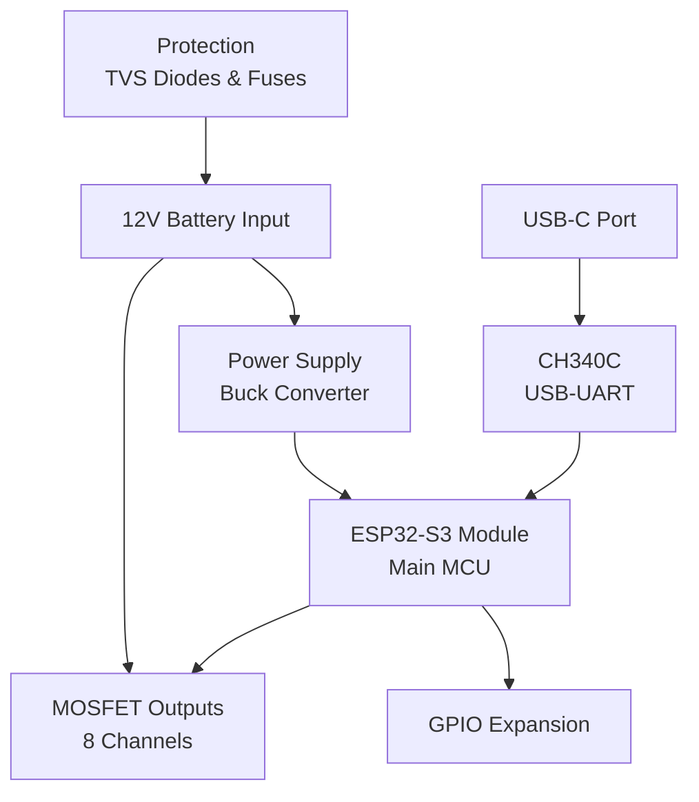

# Circuit Schematics

Complete circuit diagrams for the Moto32 control unit, with detailed explanations of each functional block.

## Download Schematics

::card-group
  :::card
  ---
  icon: i-lucide-file-text
  title: Full Schematic PDF
  to: https://github.com/jaksatomovic/motogadget-clone/tree/main/Schematics
  target: _blank
  ---
  Download complete schematic in PDF format
  :::

  :::card
  ---
  icon: i-lucide-image
  title: Schematic Preview
  to: https://github.com/jaksatomovic/motogadget-clone/blob/main/scheme.png
  target: _blank
  ---
  View PNG preview of schematic
  :::

  :::card
  ---
  icon: i-lucide-code
  title: EasyEDA Source
  to: https://github.com/jaksatomovic/motogadget-clone/tree/main/EasyEDA%20Source%20Files
  target: _blank
  ---
  Editable source files in EasyEDA format
  :::
::

## Circuit Overview

The Moto32 circuit is divided into several functional blocks:



## Power Supply Section

### Input Power

**12V Automotive Supply**

```
Battery+ ──[Fuse]──[D1]──[C2]── 12V Rail
                              │
                              └── To Buck Converter (U3)
                              └── To MOSFET Sources
```

**Components:**
- **Input Fuse**: 10A recommended (external)
- **D1 (SS34)**: Schottky diode for reverse polarity protection
  - Forward voltage: ~0.5V
  - Current rating: 3A
  - Protects circuit if battery connected backwards
- **C2 (22µF)**: Input bulk capacitance
  - Filters battery noise
  - Smooths load transients

::callout{icon="i-lucide-info" color="blue"}
**Why Schottky?** Lower forward voltage drop than standard diodes, reducing power loss and heat generation.
::

### Buck Converter (3.3V Regulator)

**AP63203WU-7 Step-Down Converter**

```
12V ─┬─[U3: AP63203]─┬─ 3.3V @ 2A
     │               │
     └─[C10,C11]     └─[C4,C12]
        Input Cap       Output Cap
```

**Key Specifications:**
- Input voltage: 3.8V to 32V (handles automotive transients)
- Output voltage: 3.3V fixed
- Output current: Up to 2A
- Switching frequency: ~1.5MHz
- Efficiency: >90% typical at 12V input

**Circuit Details:**
- **C10, C11**: 22µF input capacitors (low ESR ceramic)
- **C4, C12**: 10µF output capacitors
- **FB Network**: Feedback resistors set output voltage
- **SW Pin**: Switching node (connect to inductor if external)

**Protection Features:**
:prose-ul{icon="i-lucide-shield"}
- Thermal shutdown
- Output short-circuit protection
- Overcurrent limiting
- Under-voltage lockout (UVLO)

## ESP32-S3 Module Section

### MCU Module

**ESP32-S3-WROOM-1-N8R2**

```
              ┌─────────────────┐
     3.3V ────┤ VCC         GPIO│──── To MOSFETs
     GND  ────┤ GND      GPIO   │──── Inputs
    UART0 ────┤ TXD/RXD   GPIO  │──── I2C/SPI
     EN   ────┤ EN        GPIO   │──── Expansion
     BOOT ────┤ GPIO0     EN     │──── Enable
              └─────────────────┘
```

**Power Supply:**
- **C1 (1µF)**: Primary decoupling capacitor (close to VCC pin)
- **C3, C5-C9 (100nF)**: Additional decoupling
- **R1 (10kΩ)**: Pull-up on EN (enable) pin

**Programming Interface:**
- **R2 (100kΩ)**: Boot mode pull-up
- **UART0**: Connected to CH340C for USB programming
- **GPIO0**: Boot select (LOW = download mode)

**Module Features:**
:prose-ul{icon="i-lucide-cpu"}
- Dual-core Xtensa LX7 @ 240MHz
- 8MB Flash memory
- 2MB PSRAM
- Wi-Fi 802.11 b/g/n
- Bluetooth 5.0 LE
- 45x GPIO pins (many multiplexed)

### GPIO Assignments

**Default Pin Mapping:**

| GPIO | Function | Direction | Notes |
|------|----------|-----------|-------|
| GPIO0 | Boot Mode | Input | Pull-up, LOW = download mode |
| GPIO1-8 | MOSFET Gates | Output | Control 8 output channels |
| GPIO9-16 | Input Switches | Input | Handlebar switches, sensors |
| GPIO17-18 | I2C (SDA/SCL) | Bidirectional | Future expansion (IMU, sensors) |
| GPIO19-20 | CAN (TX/RX) | Bidirectional | Future CAN bus support |
| GPIO43/44 | UART0 (TX/RX) | Bidirectional | USB programming |

::callout{icon="i-lucide-info" color="blue"}
**Customizable**: GPIO assignments can be changed in firmware to match your specific requirements.
::

## USB Interface Section

### USB-C Connector & CH340C

**USB-to-Serial Bridge**

```
USB-C ──[D4,D5]──┬── D+ ──[R20,R21]──┬── CH340C
                 │                    │
                 └── D- ──[R18,R19]──┘
                         
CH340C ──[TXD/RXD]── ESP32 UART0
       │
       └──[X1: 12MHz]── Crystal Oscillator
```

**USB Protection:**
- **D4, D5 (SMBJ58A)**: TVS diodes on USB data lines
  - Clamp ESD transients to safe levels
  - Bidirectional protection
  - Fast response time (<1ps)

**CH340C Circuit:**
- **U2 (CH340C)**: USB-to-UART converter IC
  - No external crystal needed (uses internal oscillator)
  - Automatic handshaking
  - 115200 baud default
- **X1 (12MHz)**: External crystal for precise timing
  - Required for stable USB communication
  - ±50ppm tolerance

**Serial Connection:**
- **TXD**: CH340 transmit → ESP32 RXD
- **RXD**: CH340 receive → ESP32 TXD
- **DTR/RTS**: Automatic bootloader entry (if connected)

::callout{icon="i-lucide-usb" color="purple"}
**Driver Note**: CH340 requires drivers on some operating systems. Download from manufacturer or install automatically via OS.
::

## MOSFET Output Section

### High-Side Switch Design

Each of the 8 outputs uses identical circuitry:

```
12V+ ────┬────────┬──── OUTPUT (to load)
         │        │
      [Source] [DMP4015SK3Q-13]
         │        │
      [Drain]     │
         │        │
     [Gate]───[R: 10kΩ]──── ESP32 GPIO
         │
        [R: 10kΩ]
         │
        GND
```

**MOSFET: DMP4015SK3Q-13**

| Parameter | Value | Notes |
|-----------|-------|-------|
| Type | P-Channel MOSFET | High-side switching |
| VDS | -40V | Voltage rating |
| ID | -11A | Continuous drain current |
| RDS(on) | 45mΩ @ -10V VGS | Low on-resistance |
| Package | TO-252-2 (DPAK) | Surface mount |
| VGS(th) | -0.5V to -1.5V | Gate threshold voltage |

**Circuit Operation:**

**Output OFF (Default State):**
- ESP32 GPIO: HIGH (3.3V) or FLOATING
- Gate pulled HIGH through 10kΩ resistor
- Gate-Source voltage: ~0V
- MOSFET: OFF (no conduction)
- Output: FLOATING (no voltage)

**Output ON (Activated):**
- ESP32 GPIO: LOW (0V)
- Gate pulled to GND through GPIO
- Gate-Source voltage: -12V
- MOSFET: FULLY ON (low resistance)
- Output: ~12V (battery voltage)

**Gate Resistor (10kΩ):**
- Limits gate current during switching
- Slows switching edge (reduces EMI)
- Provides default OFF state
- Acts as pull-up to 12V

::callout{icon="i-lucide-lightbulb" color="yellow"}
**Logic Level**: Unlike typical P-channel designs, these MOSFETs are activated by pulling gate LOW (to GND), not below source.
::

### Output Capabilities

**Maximum Load Current:**

Each output can safely handle:
- **Continuous**: ~5A (with adequate cooling)
- **Peak**: 10A (short duration)
- **Fused**: External 5-10A fuse per output recommended

**Typical Motorcycle Loads:**

| Load | Current | Suitable? |
|------|---------|-----------|
| Headlight (LED) | 1-3A | ✅ Yes |
| Headlight (Halogen 55W) | 4.5A | ✅ Yes (with fuse) |
| Tail/Brake Light (LED) | 0.2-1A | ✅ Yes |
| Turn Signal (LED) | 0.2-0.5A | ✅ Yes |
| Horn | 2-5A | ✅ Yes |
| Ignition Coil | 2-4A | ✅ Yes |
| Fuel Pump | 3-6A | ✅ Yes (with fuse) |
| Starter Relay (coil) | 0.5-1A | ✅ Yes |
| Cooling Fan | 5-10A | ⚠️ Use relay |

::callout{icon="i-lucide-alert-triangle" color="amber"}
**High Current Loads**: For loads >5A continuous, consider using Moto32 to drive a relay, with the relay switching the high-current load.
::

### Inductive Load Protection

**Flyback Protection (Built-in):**

MOSFETs have internal body diodes that provide flyback protection for inductive loads (relays, solenoids):

```
      OUTPUT
         │
    [Inductive Load]
         │
        GND
         
Internal Body Diode:
  - Clamps negative voltage spikes
  - Protects MOSFET from back-EMF
  - No external diode needed
```

For heavy inductive loads, external TVS diodes can be added across outputs for additional protection.

## Protection Circuits

### TVS Diodes

**SMBJ58A Transient Voltage Suppressors**

```
12V+ ────[D4]──── To Circuit
         │
        GND

USB D+ ──[D5]──┐
               │
USB D- ──[D5]──┤
               │
              GND
```

**Specifications:**
- Breakdown voltage: 58V nominal
- Clamping voltage: <94V @ 10A
- Peak pulse power: 600W
- Response time: <1ps

**Protection Against:**
:prose-ul{icon="i-lucide-shield"}
- Load dump transients (alternator disconnect)
- Inductive kick-back from large loads
- ESD (electrostatic discharge)
- Ignition system noise
- Starter motor transients

### Fuse Recommendations

**Main Power Input:**
- **Rating**: 10A fast-blow
- **Type**: Automotive blade fuse (ATO/ATC)
- **Location**: Inline near battery connection

**Individual Output Fusing (Optional):**
- **Rating**: 5-10A per output (match load)
- **Type**: Automotive mini blade fuse
- **Benefit**: Isolates fault to single output

## Input Conditioning

### Switch Inputs

Recommended circuit for handlebar switches:

```
3.3V ────[10kΩ]────┬──── GPIO Input
                   │
               [Switch]
                   │
                  GND
```

**Features:**
- Pull-up resistor provides default HIGH state
- Switch to GND for active LOW
- GPIO internal pull-ups can be used (20-50kΩ)
- Add 100nF capacitor for debouncing if needed

**Input Protection:**

For inputs exposed to vehicle electrical system:

```
12V Signal ──[10kΩ]──┬──[10kΩ]──── GPIO
                     │
                  [3.3V Zener]
                     │
                    GND
```

- Voltage divider reduces 12V to 3.3V safe levels
- Zener diode clamps overvoltage
- Series resistor limits current

## Expansion Interfaces

### I2C Bus

For adding sensors (IMU, temperature, etc.):

```
ESP32 SDA ──┬──[4.7kΩ]── 3.3V
            │
        [Sensor SDA]
            
ESP32 SCL ──┬──[4.7kΩ]── 3.3V
            │
        [Sensor SCL]
```

**Common I2C Additions:**
- IMU (lean angle sensor for turn signal auto-cancel)
- Temperature sensor (thermal monitoring)
- RTC (real-time clock for data logging)
- EEPROM (configuration storage)

### SPI Bus

For high-speed peripherals:

- CAN bus transceivers
- SD card for logging
- External ADCs for analog inputs

### CAN Bus (Future)

Planned addition for modern motorcycle communication:

```
ESP32 CAN_TX ──┬── CAN Transceiver ──┬── CAN_H
ESP32 CAN_RX ──┘   (e.g., MCP2551)   └── CAN_L
```

**Applications:**
- Read ECU data (RPM, temperature, errors)
- Communicate with ABS module
- Integrate with TFT dashboard
- Log vehicle data

## PCB Traces & Grounding

### Power Traces

**Trace Width Calculations:**

| Net | Current | Width | Notes |
|-----|---------|-------|-------|
| 12V Input | 5A | >50 mil | Wide traces, multiple layers |
| 3.3V Rail | 2A | >30 mil | Star topology from regulator |
| MOSFET Output | 5A each | >40 mil | Keep traces short |
| Ground | All return | Plane | Solid ground planes |

### Ground Strategy

**Multi-point grounding:**
- Separate analog and digital grounds at PCB level
- Single point connection at power supply
- Ground planes on inner layers
- Via stitching for low impedance

**Ground Loops Prevention:**
- Star grounding for power
- Avoid ground loops in signal paths
- Keep high current returns separate

## Reading the Schematic

### Component Designators

| Prefix | Component Type | Example |
|--------|---------------|---------|
| U | Integrated Circuit | U1 (ESP32), U2 (CH340) |
| Q | Transistor/MOSFET | Q5-Q12 (MOSFETs) |
| R | Resistor | R1 (10kΩ) |
| C | Capacitor | C1 (1µF) |
| D | Diode | D1 (SS34) |
| L | Inductor | L1 (if present) |
| X | Crystal | X1 (12MHz) |
| J | Connector | J1, J2 |

### Net Names

Common net naming in schematic:
- **VCC / 3V3**: 3.3V power rail
- **12V / VBAT**: 12V battery input
- **GND**: Ground / 0V reference
- **OUTx**: MOSFET output channels
- **INx**: GPIO input channels

## Design Calculations

### Power Dissipation

**Buck Converter:**
```
Input Power = 12V × 0.5A = 6W
Output Power = 3.3V × 1.5A = 4.95W
Efficiency = 4.95W / 6W = 82.5%
Heat = 6W - 4.95W = 1.05W
```

**MOSFET Losses:**
```
Per MOSFET @ 5A load:
RDS(on) = 45mΩ
Power = I² × R = 5² × 0.045 = 1.125W
```

::callout{icon="i-lucide-thermometer" color="amber"}
**Thermal Management**: MOSFETs may need heatsinking for continuous high-current operation. Consider PCB copper area as heatsink.
::

## Schematic Checklist

When reviewing or modifying the schematic:

:prose-ul{icon="i-lucide-check-square"}
- [ ] All ICs have decoupling capacitors
- [ ] Power supply properly rated for load
- [ ] Protection diodes oriented correctly
- [ ] MOSFET source/drain connections correct
- [ ] Pull-up/pull-down resistors on all inputs
- [ ] No floating inputs or outputs
- [ ] Ground connections complete
- [ ] Fusing adequate for loads
- [ ] Component ratings exceed requirements
- [ ] Test points for critical signals

## Next Steps

::card-group
  :::card
  ---
  icon: i-lucide-list
  title: Bill of Materials
  to: /hardware/bill-of-materials
  ---
  Get part numbers for all components
  :::

  :::card
  ---
  icon: i-lucide-wrench
  title: Assembly Guide
  to: /hardware/assembly
  ---
  Learn how to assemble the PCB
  :::

  :::card
  ---
  icon: i-lucide-package
  title: PCB Overview
  to: /hardware/pcb-overview
  ---
  Understand the physical PCB design
  :::

  :::card
  ---
  icon: i-lucide-download
  title: Download Files
  to: https://github.com/jaksatomovic/motogadget-clone/tree/main/Schematics
  target: _blank
  ---
  Get schematic PDF and source files
  :::
::

